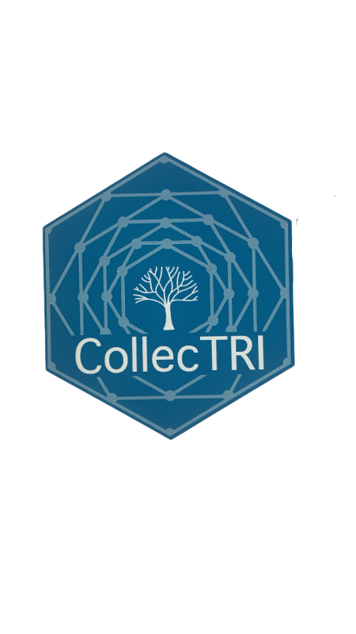

# CollecTRI: **Collec**tion of **T**ranscriptional **R**egulatory **I**nteractions 

<!-- badges: start -->
<!-- badges: end -->

## Overview
CollecTRI is a gene regulatory network (GRN) containing signed transcription factor
(TF) - target gene interactions. TF-gene interactions were manually curated and 
collected from ExTRI, HTRI, TRRUST, TFActS, IntAct, SIGNOR, CytReg, GEREDB and 
Pavlidis. CollecTRI was benchmarked using the knockTF datasets and showed a
superior performance compared to other known GRNs.

## Data availability 

CollecTRI is available through 
[OmniPath](http://bioconductor.org/packages/release/data/experiment/html/dorothea.html) 
or can be accessed through the DoRothEA bioconductor package.

## License

## Citation
> 
