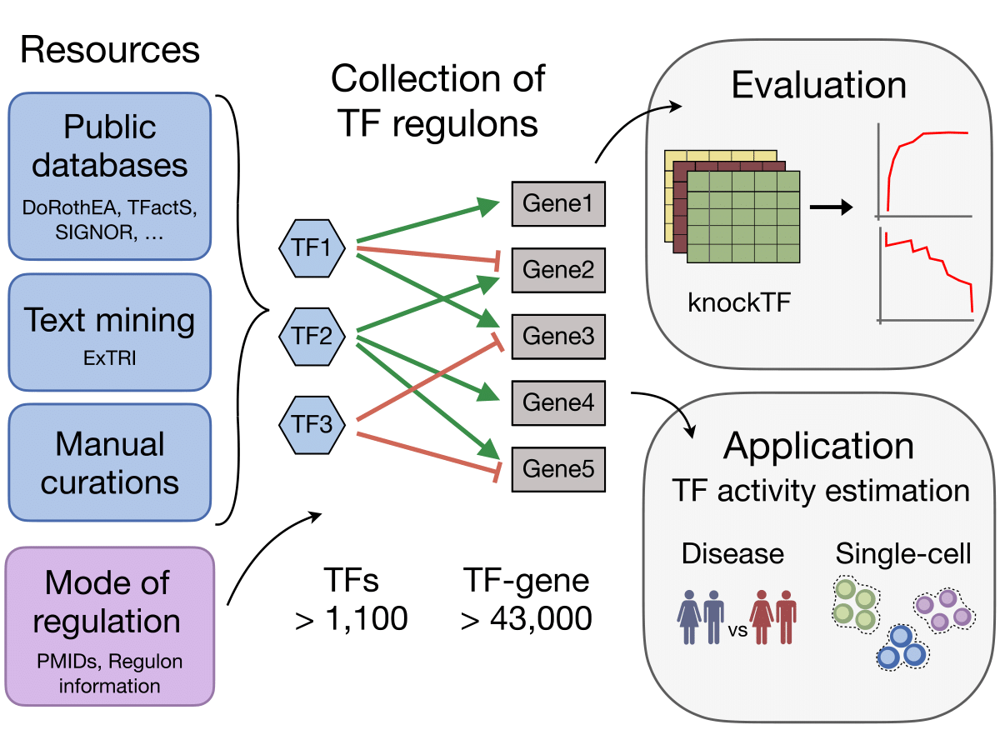

# CollecTRI: **Collec**tion of **T**ranscriptional **R**egulatory **I**nteractions 

<!-- badges: start -->
<!-- badges: end -->

## Overview
The CollecTRI-derived regulons contain signed transcription factor (TF) - target gene 
interactions compiled from 12 different resources. This collection provides 
an increased coverage of transcription factors and was benchmarked against 
other known GRNs, showing a superior performance in identifying perturbed TFs 
based on gene expression data using the knockTF data sets.

<p align="center" width="100%">

</p>

## Data availability 
The CollecTRI regulons are available through the [OmniPath](https://omnipathdb.org/) or [DoRothEA](https://saezlab.github.io/dorothea/) packages.
To load the CollecTRI regulons through R or python:
```r
## load collecTRI regulons via Omnipath
## the complexes AP1 and NFKB are listed with all potential constituents

OmnipathR::collectri()
```

```python
## load collecTRI regulons via Omnipath
## the complexes AP1 and NFKB are listed with all potential constituents

import omnipath
omnipath.interactions.CollecTRI.get()
```

## Resources included in CollecTRI
ExTRI, HTRI, TRRUST, TFActS, IntAct, SIGNOR, CytReg, GEREDB, Pavlidis, DoRothEA A, NTNU curations

## Scripts
For more information about the CollecTRI-derived regulons, please check out the following scripts:

- [Construction of CollecTRI regulons](https://github.com/saezlab/CollecTRI/tree/main/scripts/CollecTRI)
- [Benchmark](https://github.com/saezlab/CollecTRI/tree/main/scripts/benchmark)
  - [Systematic comparison](https://github.com/saezlab/CollecTRI/blob/main/scripts/benchmark/02_benchmark.ipynb)
  - [Evaluation of binding weights](https://github.com/saezlab/CollecTRI/blob/main/scripts/benchmark/03_benchmark_weights.ipynb)
  - [Statistical evaluation](https://github.com/saezlab/CollecTRI/blob/main/scripts/benchmark/05_statistics.R)
- [Case study](https://github.com/saezlab/CollecTRI/blob/main/scripts/casestudy/case_study.R)
- [Manuscript figures](https://github.com/saezlab/CollecTRI/blob/main/scripts/figures/figures_manuscript.R)

If you are interested in the construction of the CollecTRI meta-resource check
out this [repository](https://github.com/Rbbt-Workflows/ExTRI)

## License
The CollecTRI-derived regulons are freely available to the community. The original licenses of all 
resources included in CollecTRI can be found [here](https://github.com/saezlab/pypath/blob/master/pypath/resources/data/resources.json)


## Citation
> 
